# covid-19-sentiment-analysis

***creating an app that identifies misinformation with a 91.4% accuracy***

*Pegah Mirghafari*
___

## WHY?!

People seem to be confused about what they're supposed to be doing, ***wearing a mask and social distancing***, and thanks to the internet, anyone can spread whatever "news" they find and give "instructions" on what to do or not do. 
Unfortunately, it seems as ***critical thinking*** no longer comes pre-install in humans, and common sense is a thing of the past. No one cares that they could put another person's health and life in jeopardy. People can't comprehend that surviving COVID is not without costs. Besides the hospital bills, COVID will damage your lungs for a lifetime. For a country that doesn't have universal healthcare, where many people go bankrupt if they ever get admitted to the ER, people are too careless. 
It's like once you get to adulthood, you have to drop decency at the door and pick up the *" each man for himself"* package. The mentality of "I'm young with no underlying health condition" has killed millions of us, and will in the future. when I hear someone say, "well, they died because they had underlying health conditions, they didn't die from COVID," I want to pull every strand of my hair (which I love dearly) out of my scalp! ***If those people didn't have COVID, their underlying health condition wouldn't have just killed them"*** 
I get it, we don't care about other people, why should we?! but why do we not care for ourselves and our loved ones?! COVID enters a body through air droplets. All we have to do to get it is breathe the same air as someone who has it. I get that not everyone wants to be a hero and save lives. All we ask of you is to wear a mask and save yours! But perhaps this is natural selection in progress.
And don't get me started with the "this is just like flue" "flu kills more people." why is this still an argument?! we have a cure. A vaccine for the flu, yet the number of deaths in a year associated with flu, is just a fraction of the number of COVID fatalities in just the six months. 
Lastly, I can't help but compare COVID to STDs; sure, you may not die from the, but the effects are lifelong. I don't see people being careless with their protections when it comes to STDs, and you can't just get STDs by walking around or breathing the same air. Not wearing a mask is probably a good indicator of what type of person they are, and I am not one to socialize with them. 
## PLEASE, ACT LIKE A DECENT HUMAN BEING, WEAR YOUR PROTECTIONS, KEEP YOURSELF SAVE! 
___

## Index:
- [Data gathering](#Data-Gathering)
- [Exploratory Data Analysis](#Exploratory-Data-Analysis)
- [The models](#Modeling)
- [Recommender](#Recommender)
- [Flask API](#Flask-API)
    
___

## Data Gathering:
 
I scareped reddit and only kept the texts, the WHO website for correct information, and used [Poynter](https://www.kaggle.com/ambityga/covid19misinformationn/) for false and missleading data. 

___

## Exploratory Data Analysis

  
here are some of the most used words in the datasets. 

frequency of words used when using Count-Vectorizer
    

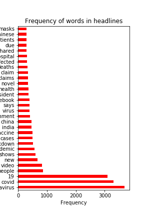
frequency of words used when tokenizing words 
  

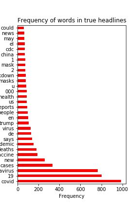
frequency of words in true information when tokenizing words
  

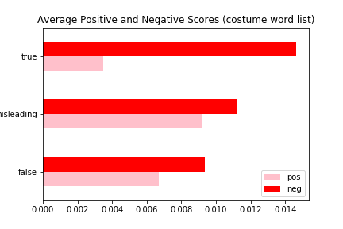
average sentiment in true, false, and misleading information, using a custom  list of words
  

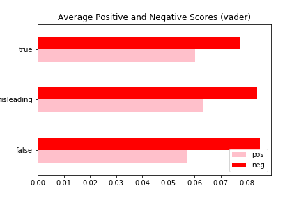
average sentiment in true, false, and misleading information, using vader 
  

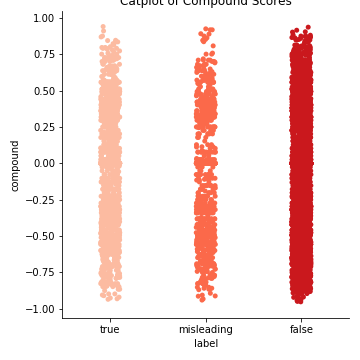
catplot of compound score of informations
  

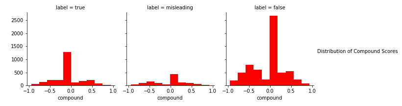
distribution of compound scores of informations
  

___
## Modeling
  
created a pipeling and by grid searching I fitted 6 models. here are The breakouts 

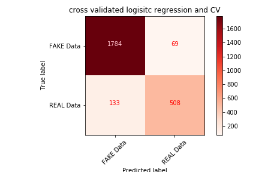
Count Vectorizer and Logistic Regression CV
Training Score: 0.990
Testing Score: 0.915 
  

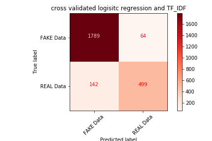
TF-IDF Vectorizer and Logistic Regression CV
Training Score: 0.994
Testing Score: 0.913
  

Count Vectorizer and Multinomial Naive Bayes
Training Score: 0.941
Testing Score: 0.909
  

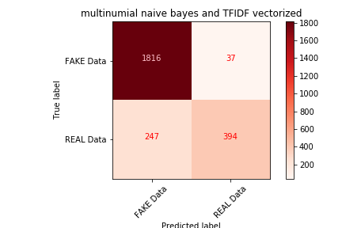
TF-IDF Vectorizer and Multinomial Naive Bayes
Training Score: 0.941
Testing Score: 0.892 
  

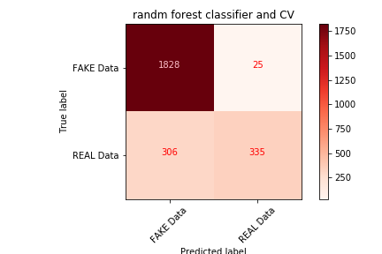
Count Vectorizer and Random Forest
Training Score: 0.883
Testing Score: 0.850 
  

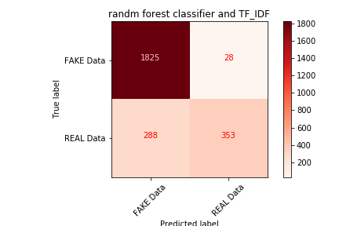
TF-IDF Vectorizer and Random Forest
Training Score: 0.906
Testing Score: 0.852  
  

___
## Flask API
  

- I just created a flask api, and imported my models via, pickle. 
- deployed the app on heroku, because I want to save the world, not lose a furtuone
- changed my domain name, to my website's name, because I'm paying for it, might as wll use it.
- **you can test out the [app here](http://misinfo.shesarocknroller.com/)**
